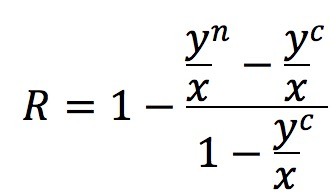

# oj
---
记录在oj上解题的思路，以便温习。<br>
[杭州电子科技大学oj网站](http://acm.hdu.edu.cn/listproblem.php?vol=1)对应的package是michael.slf4j.learning.hdu。

## [1002 A + B Problem II](http://acm.hdu.edu.cn/showproblem.php?pid=1002)
大数相加问题。将字符串数字转换成数组，然后对位相加即可。<br>
This problem is to plus two big number, which we can't store it with long type.
1. Convert number string to number array.
2. Plus the number of the same index.
---
## [1025 Constructing Roads In JGShining's Kingdom](http://acm.hdu.edu.cn/showproblem.php?pid=1025)
最长单调递增子序列问题，Longest Increasing Subsequence<br>
Data:<br>
|1|2|<br>
|3|4|<br>
|4|5|<br>
|5|8|<br>
|7|9|<br>
|2|3|<br>
|6|1|<br>
|9|7|<br>
|8|6|<br>
需要首先对数据进行排序，以左边进行排序，得到下表:<br>
|1|2|<br>
|2|3|<br>
|3|4|<br>
|4|5|<br>
|5|8|<br>
|6|1|<br>
|7|9|<br>
|8|6|<br>
|9|7|<br>
则求数组*s=[2,3,4,5,8,1,9,6,7]*的最长递增子序列。<br>
维护一个数组a，初始化a[0]=s[0]，总长度为1。<br>
遍历数组s，第二个数据3>a[0]，将数字3加入数组a，*a=[2,3]*<br>
以此类推，得到*a=[2,3,4,5,8]*<br>
s[5]=1<a[4]=8，对数组进行递归，查找第一个大于s[5]的数字，由于找不到，则替换数组的第一个元素，此时*a=[1,3,4,5,8]*<br>
s[6]=9>a[4]=8，则加入数组，*a=[1,3,4,5,8,9]*<br>
s[7]=6<a[5]=9，对数组进行递归，查找第一个大于s[7]的数字，替换a[4]，*a=[1,3,4,5,6,8]*<br>
s[8]=7<a[5]=8，对数组进行递归，查找第一个大于s[8]的数字，替换a[4]，*a=[1,3,4,5,6,9]*<br>
则最后输出结果为6。<br>
注：在查找的过程中，用**二分查找**，可使时间复杂度从**O(n^2)**降到**O(nlogn)**。

## [1026 Ignatius and the Princess I](http://acm.hdu.edu.cn/showproblem.php?pid=1026)
广度优先搜索问题，参考[广度优先搜索策略](https://blog.csdn.net/weixin_40953222/article/details/80544928).
### 广度优先搜索和深度优先搜索
两者最大的区别是，到底是优先循环还是优先递归。<br>
优先循环，则是广度优先搜索；优先递归，则是深度优先搜索。<br>
深度优先搜索虽然好用，但并不是所有的场景都适用。当问题可能没有解时，深度优先搜索会导致timeout。因此此时需要用广度优先搜索来解决。
### 广度优先搜索的原理：
1. 选定初始节点，标记为**已访问**过的元素，入列。
2. 将队列中第一个元素出列。
3. 遍历该元素的所有**未访问过**的相邻节点，标记为**已访问**过的元素，入列。
4. 重复步骤2/3，直到队列为空时，结束搜索。
### 广度优先搜索的一些特殊处理
#### 如何记录路径
在遍历每个节点的过程中，在当前节点信息Status对象中，保存父节点信息，使之成为单向链表。<br>
#### 当需要在某一处节点需要时间惩罚时该如何处理
该节点信息Status加入cost时间信息，当未达到惩罚时间时，cost时间增加，将变化后的新节点信息Status加入到队列中。因此后续队列中读取到的数据依然是该节点信息，只不过是停留n秒之后的状态。

## [1027 Ignatius and the Princess II](http://acm.hdu.edu.cn/showproblem.php?pid=1027)
参考[逆康托展开](https://blog.csdn.net/qq_40061421/article/details/81915838).

### 康托展开
举个例子说明。在（1，2，3，4，5）5个数的排列组合中，计算 34152的康托展开值。
* 首位是3，则小于3的数有两个，为1和2，a[5]=2，则首位小于3的所有排列组合为 a[0]*(5-1)!
* 第二位是4，则小于4的数有两个，为1和2，注意这里3并不能算，因为3已经在第一位，所以其实计算的是在第二位之后小于4的个数。因此a[4]=2
* 第三位是1，则在其之后小于1的数有0个，所以a[3]=0
* 第四位是5，则在其之后小于5的数有1个，为2，所以a[2]=1
* 最后一位就不用计算啦，因为在它之后已经没有数了，所以a[1]固定为0
##### 根据公式： 
X = 2 * 4! + 2 * 3! + 0 * 2! + 1 * 1! + 0 * 0! 
= 2 * 24 + 2 * 6 + 1 
= 61<br>
所以比 34152 小的组合有61个，即34152是排第62。

### 逆康托展开
一开始已经提过了，康托展开是一个全排列到一个自然数的双射，因此是可逆的。即对于上述例子，在（1，2，3，4，5）给出61可以算出起排列组合为 34152。由上述的计算过程可以容易的逆推回来，具体过程如下：
* 用 61 / 4! = 2余13，说明a[5]=2,说明比首位小的数有2个，所以首位为3。
* 用 13 / 3! = 2余1，说明a[4]=2，说明在第二位之后小于第二位的数有2个，所以第二位为4。
* 用 1 / 2! = 0余1，说明a[3]=0，说明在第三位之后没有小于第三位的数，所以第三位为1。
* 用 1 / 1! = 1余0，说明a[2]=1，说明在第二位之后小于第四位的数有1个，所以第四位为5。
* 最后一位自然就是剩下的数2啦。
##### 通过以上分析，所求排列组合为 34152。

## [1030 Delta-wave](http://acm.hdu.edu.cn/showproblem.php?pid=1030)
公式计算题：<br>
第n层最后一个元素是n^2。根据层数n和数字m，确定数字m的索引及上下区。<br>
较小的数字为a，较大的数字为b。结果route初始值为(l2-l1)*2<br>
* 如果a和b在同层，则结果是b-a。
* 如果a在上区，b在下区，则结果+1，同时a与b的索引差值大于(l2-l1+1)或小于0，则结果+Math.abs(offset-(l2-l1+1))*2。
* 如果a在下区，b在上区，则结果-1，同时a与b的索引差值大于(l2-l1-1)或小于0，则结果+Math.abs(offset-(l2-l1-1))*2。
* 如果a和b同区，则a与b的索引差值大于(l2-l1)或小于0，则结果+Math.abs(offset-(l2-l1))*2。

## [1037 Keep on Truckin'](http://acm.hdu.edu.cn/showproblem.php?pid=1037)
题意：找到第一个小于等于168的高度，输出。。。

## [1042 N!](http://acm.hdu.edu.cn/showproblem.php?pid=1042)
大数相乘问题，按位进行乘法，然后相加进位。<br>
注：为了提高效率，应每3位或4位进行相乘，以较少乘法和加法次数。

## [1045 Fire Net](http://acm.hdu.edu.cn/showproblem.php?pid=1045)
深度优先搜索问题
### 解题思路
* 找出每一个点的与之关联的所有节点，生成relationMap关系图。
* 优先过滤出relationMap中相关节点数为0的节点，这代表该节点没有任何与之相邻的节点，直接计数并从遍历列表中删除该节点。
* 在剩余节点中逐个访问节点：
	* 获取该节点p的关联节点列表relationSet。
	* 对relationSet和当前遍历节点列表tmpSet取交集crossSet。
	* crossSet中添加当前当前节点p。
	* 当前这一步放置，计数+1，同时在当前节点列表tmpSet中删除crossSet中的全部节点，进行深度优先搜索。
	* 搜索结束，重新将crossSet中的节点加入当前节点列表tmpSet。
* 循环结束，找到最大值。

## [1067 Gap](http://acm.hdu.edu.cn/showproblem.php?pid=1067)
深度优先搜索+剪枝与哈希算法问题
### 深度优先搜索
深度优先搜索之前也有说过了，这里不做赘述了。
### 剪枝与哈希算法
#### 剪枝
当我们进行深度优先搜索时，为了减少计算次数，提高效率，剪枝是必不可少的。
我们需要对以下两种情况进行剪枝：
* 在遍历出现相同的情况时，直接返回上一次记录的结果，以免重复计算。
* 在当前步骤的最好情况已经比目前已知最坏情况还差，则无需计算，直接返回。
	* 例如，求最小步骤，在第n层已知的最小步骤为m，而后续i>=n层时，计算的最小步骤为j>=m，那么此时无论后续如何计算，都不可能使得j<m，所以后续不需要计算，直接返回当前不需要的分枝即可。
#### 哈希算法
当再次出现相同的情况，我们需要返回之前已经计算好的结果，以免重复计算，提高效率。<br>
那么在本题中有28个不同的数字和4个0组成，那么就算不考虑0的个数问题，也至少有**29！**种排列组合。这些组合数完全超过了Integer(2^32)的范围，甚至也超过了Long(2^64)的范围，因此无法用已知的数字类型来记录哈希值。所以如何获取当前盘面的唯一哈希值成为了解题的关键。<br>
本地中，有32个数字，是一个4*8的二维数组，因此化简为4个8位的一维数组进行求哈希值。
```
number total = 0;
for (int i = 4; i >= 1; i--) {
    total *= 150;//这里为什么是150，是经过实验得到的，并不一定是最优解。
    number sum = 0;
    for (int j = 8; j >= 1; j--) {
        sum *= 8;
        sum += decode(cell value);
    }
    total *= sum;
}
```
注：这里不可能用long型进行处理，因此我在写代码时考虑了两种解决方案，一个是BigDecimal，另一个是自己实现的大数相乘和大数相加算法。后经过测试，第一种方法要比第二种方法慢很多，时间消耗比为3:2。<br>
确定唯一哈希值之后，可以将盘面的情况进行保存，大幅提升效率。

## [1072 Nightmare](http://acm.hdu.edu.cn/showproblem.php?pid=1072)
广度优先搜索
### 解题思路
这道题和之前的[1026 Ignatius and the Princess I](http://acm.hdu.edu.cn/showproblem.php?pid=1026)是类似的，都是广度优先搜索来解决问题。不过还是有一点区别的，区别在于1026需要在某些点停留，且每次移动不能重复之前走过的路径，而本题可以重复走之前走过的路径，但是连续走6步且不经过‘4’标记点，则搜索结束。所以说都是广度优先搜索的不同变种题。<br>
对于本题有一个限制，就是内存限制，对于1026，由于不能重复之前的路径，所以几乎不会出现内存溢出的情况，而本题可以重复之前的路径，如果处理不当，极可能导致内存问题。考虑下面一种情况：
```
1 2 1 0 1 4
1 1 1 1 4 1
1 0 1 0 0 0
4 4 4 1 1 3
```
在[1,4]和[0,5]之间和[3,0]和[3,2]之间如果处理不当，容易出现超时和内存问题，所以需要做下面的判断，是否第一次访问‘4’节点。如果不是，则不需要访问该点，因为‘4’节点在最优路径上不可能访问两次及以上（自己去证明一下吧）。

## [1107 武林](http://acm.hdu.edu.cn/showproblem.php?pid=1107)
不是很难的题，不知道为什么做的人这么少。也不涉及到动态规划／广度优先搜索，老老实实的写好循环就好了，同时注意处理战斗后的移动先加入缓存，以免影响其他格子的处理。<br>
真就是面向对象的继承和多态呗？用Enum在处理类型是真的方便。好水的题。。。

## [1130 How Many Trees?](http://acm.hdu.edu.cn/showproblem.php?pid=1130)
[卡塔兰数](https://baike.baidu.com/item/%E5%8D%A1%E7%89%B9%E5%85%B0%E6%95%B0/6125746?fromtitle=%E5%8D%A1%E5%A1%94%E5%85%B0%E6%95%B0&fromid=9133402&fr=aladdin)，学到了。。。

## [1157 Who's in the Middle](http://acm.hdu.edu.cn/showproblem.php?pid=1157)
给定一个奇数，然后找中位数。

## [1158 Employment Planning](http://acm.hdu.edu.cn/showproblem.php?pid=1158)
动态规划问题。<br>
首先确定worker中的最大值max和最小值min，然后创建dp数组。<br>
假设当前月份monthX的worker数为x，那么当前的开销即dpX应该为，上一层的开销为：<br>
dp(X-1)(loop from 上一层worker数 to max worker)+差值✖(fire or hire)+当前总数✖(salary)。<br>

## [1159 Common Subsequence](http://acm.hdu.edu.cn/showproblem.php?pid=1159)
最长公共子序列问题。[详细解释](https://blog.csdn.net/hrn1216/article/details/51534607)

## [1176 免费馅饼](http://acm.hdu.edu.cn/showproblem.php?pid=1176)
动态规划问题，下一时刻最大值等于前一时刻的j-1,j,j+1的最大值+当前时间的馅饼数。

## [1181 变形课](http://acm.hdu.edu.cn/showproblem.php?pid=1181)
广度优先搜索。深度优先搜索应该也可以，不过可能会超时，毕竟存在无解的情况。

## [1194 Beat the Spread!](http://acm.hdu.edu.cn/showproblem.php?pid=1194)
有两个整数，第一个输入x是两个数的和，第二个输入y是两个数差值的绝对值，求这两个整数。

## [1195 Open the Lock](http://acm.hdu.edu.cn/showproblem.php?pid=1195)
广度优先搜索问题。

## [1199 Color the Ball](http://acm.hdu.edu.cn/showproblem.php?pid=1199)
我觉得我对了，哈哈

## [1204 糖果大战](http://acm.hdu.edu.cn/showproblem.php?pid=1204)
y为单局输的概率，x为单局赢的概率。n为自己游泳糖果数，c为所有糖果总数。


## [1208 Pascal's Travels](http://acm.hdu.edu.cn/showproblem.php?pid=1208)
动态规划+深度优先搜索+记忆搜索
### 动态规划
对迷局进行预处理，把所有不可达的点都进行标记，减少搜索时的无效步数。<br>

动态规划把每一步的可能性进行整理标记，计算出每一个点的方向选择可能性。<br>
0代表没有结果，1代表向下走，2代表向右走，3代表2个方向都可以走。<br>
以测试数据为例：<br>
```
5
11101
01111
11111
11101
11101
```
我们可以得到下面的数组：<br>
```
23101
03331
22221
00001
00000
```
在0,0点只能向右走，所以choices 0,0=2。<br>
在0,1点可以向右和向下，所以choices0,1=3。<br>
在0,2点只能向下走，所以choices0,2=1。<br>
考虑2,1点，单从相邻值考虑，可以向下走，但是4,2不可向右走，导致4,x都不可向右走，所以都是无效点，从而导致3,x也都是无效点，那么2,1点向下的点都是无效点，那么也就只能向右走。<br>
因此在整理之后，随后的深度优先搜索可以少走一些不必要的无效点，提高效率。

### 深度优先搜索+记忆搜索
进行搜索，将结果保存起来。

## [1210 Eddy's 洗牌问题](http://acm.hdu.edu.cn/showproblem.php?pid=1210)
观察数字1的位置，规律为上一次1出现的位置x*2 mod (n*2 + 1)。

## [1212 Big Number](http://acm.hdu.edu.cn/showproblem.php?pid=1212)
大数求模。<br>
观察这组数据，v=152455856554521/mod=3250，分别对15245及其结果求模即可得到结果。

## [1224 Free DIY Tour](http://acm.hdu.edu.cn/showproblem.php?pid=1224)
本题的方法有很多，dfs/bfs/dp。本题用的dp算法，当然还有其他算法，例如floyd算法和Bellman-Ford算法，以后再探索吧。

### 动态规划

下面这组数据中，后面4行代表路径。
```
3
0 70 90
4
1 2
1 3
2 4
3 4
```
想得到最长路径，首先得到每条路径和那个的最大值。1->1路径上，需要分别知道1->4/2->4/3->4的最大值。而得到3->4最大值，就要2->4/1->4，以此类推。我在解决该问题时，用逆序思路进行求解。<br>
假设现在我们求3->2的最大值，那么就分解为2这层的最大值与**3这层的最大值+interest{2}进行比较**。<br>
从而建立dp数组。

## [1231 最大连续子序列](http://acm.hdu.edu.cn/showproblem.php?pid=1231)
贪心选择，之前的题目的变种，等于记录序列值。

## [1232 畅通工程](http://acm.hdu.edu.cn/showproblem.php?pid=1232)
这题和[1213 How Many Tables](http://acm.hdu.edu.cn/showproblem.php?pid=1213)一模一样。

## [1233 还是畅通工程](http://acm.hdu.edu.cn/showproblem.php?pid=1233)
最小生成树算法，Prim和Kruskal两种。
### Prim算法
假设有n个顶点，0->n-1。随便选一个点为初始顶点，假设取0，加入到eSet中。则重复以下步骤直到eSet size = n。
1. 遍历eSet中所有顶点，循环遍历所有可达边。
2. 若边的另外一个点e已经存在与eSet，则跳过。
3. 选取所有遍历的边的最小值，将其顶点e加入到eSet。
### Kruskal算法
假设有n个顶点，m条边。
1. 将m条边根据v距离进行排序。
2. 每次选取值v最小的边。若2端顶点已经存在于某一个eSet中，则跳过。
3. 假设两端顶点为a,b。
	* 若a和b均不存在于任何一个set，则加入一个新的eSetK。
	* 若a存在与eSet1，而b不能存在于任何一个其他set，则加b加入eSet1。
	* 若a存在于eSet1，而b存在于eSet2，则合并eSet1和eSet2。
4. 重复2/3步骤，直到只有一个eSet，且size=n。

## [1243 反恐训练营](http://acm.hdu.edu.cn/showproblem.php?pid=1243)
最长公共子序列的变形。问题同[1159 Common Subsequence](https://github.com/hexin1250/oj#1159-common-subsequence)一致。还是来描述一下过程吧。

### 最长公共子序列
#### 核心思想 i j处字符相同时，dp{i}{j}=dp{i-1}{j-1}+1，否则dp{i}{j}=max(dp{i-1}{j},dp{i}{j-1})
假设两个字符串为s1={1,3,4,5,6,7,7,8},s2={3,5,7,4,8,6,7,8,2}，初始状态：
```
    3 5 7 4 8 6 7 8 2
  0 0 0 0 0 0 0 0 0 0
1 0 0 0 0 0 0 0 0 0 0
3 0
4 0
5 0
6 0
7 0
7 0
8 0
```
数字1出都是0，遍历3得到下面结果：
```
    3 5 7 4 8 6 7 8 2
  0 0 0 0 0 0 0 0 0 0
1 0 0 0 0 0 0 0 0 0 0
3 0 1 1 1 1 1 1 1 1 1
4 0
5 0
6 0
7 0
7 0
8 0
```
遍历4：
```
    3 5 7 4 8 6 7 8 2
  0 0 0 0 0 0 0 0 0 0
1 0 0 0 0 0 0 0 0 0 0
3 0 1 1 1 1 1 1 1 1 1
4 0 1 1 1 2 2 2 2 2 2
5 0
6 0
7 0
7 0
8 0
```
以此类推，遍历7、8:
```
    3 5 7 4 8 6 7 8 2
  0 0 0 0 0 0 0 0 0 0
1 0 0 0 0 0 0 0 0 0 0
3 0 1 1 1 1 1 1 1 1 1
4 0 1 1 1 2 2 2 2 2 2
5 0 1 2 2 2 2 2 2 2 2
6 0 1 2 2 2 2 3 3 3 3
7 0 1 2 3 3 3 3 4 4 4
7 0 1 2 3 4 4 4 4 4 4
8 0 1 2 3 4 5 5 5 5 5
```
则得到最长子序列为{3,4,6,7,8}或{3,5,7,7,8}。

## [1246 自共轭Ferrers图](http://acm.hdu.edu.cn/showproblem.php?pid=1246)
n=1
```
·
```
n=3
```
··
·
```
n=4
```
··
··
```
n=5
```
···
·
·
```
n=6
```
···
··
·
```
n=7
```
····
·
·
·
```
最大长度为：n为奇数，(n+1)/2，偶数，n/2。以下为伪代码：
```
int getCount(n, max){
	if n=0 return 1
	current_max=Min(max,max_length(n))
	count=0
	for i=current_max to 1
	do
		n + 1 - 2 * i > (i - 1) * (i - 1)
			break;
		count+=getCount(n-2*i+1,i)
	done
}
```

## [1248 寒冰王座](http://acm.hdu.edu.cn/showproblem.php?pid=1248)
完全背包问题：动态规划。只要debug一遍[code](https://github.com/hexin1250/oj/blob/master/src/main/java/michael/slf4j/learning/hdu/C1248.java)就明白了。

## [1254 推箱子](http://acm.hdu.edu.cn/showproblem.php?pid=1254)
非常非常好的一道题，特别考验细节。
* 一定要两次bfs，一次是箱子的bfs，另一次是人的bfs。
* 在人的bfs中，一定要把箱子当作障碍物。
* 计算状态时，要把人和箱子都算在内。

## [1298 T9](http://acm.hdu.edu.cn/showproblem.php?pid=1298)
字典树：根据输入字符串生成字典树。但需要注意以下几点：
1. 当再次遍历到某一个节点时，概率要进行相加。
2. 当概率相同时，按照字典序进行输出，但是这里的概率相同指的是每一层的概率都相同且为最大值的情况下。
3. 在对字典树遍历时，若该层已经找不到任何符合条件的结果，后续层无需查找，直接返回null。

## [1301 Jungle Roads](http://acm.hdu.edu.cn/showproblem.php?pid=1301)
最小生成树问题。同[1233 还是畅通工程](http://acm.hdu.edu.cn/showproblem.php?pid=1233)。

## [1323 Perfection](http://acm.hdu.edu.cn/showproblem.php?pid=1323)
完美数就5个，只需要判断n是不是完美数，如果不是完美数，判断因子总和sum与n的关系，如果sum<n则DEFICIENT，如果大于，则判断是否是完美数的倍数，如果不是则DEFICIENT，是则ABUNDANT。

## [1354 Choose Your Own Adventure](http://acm.hdu.edu.cn/showproblem.php?pid=1354)
广度优先搜索。
